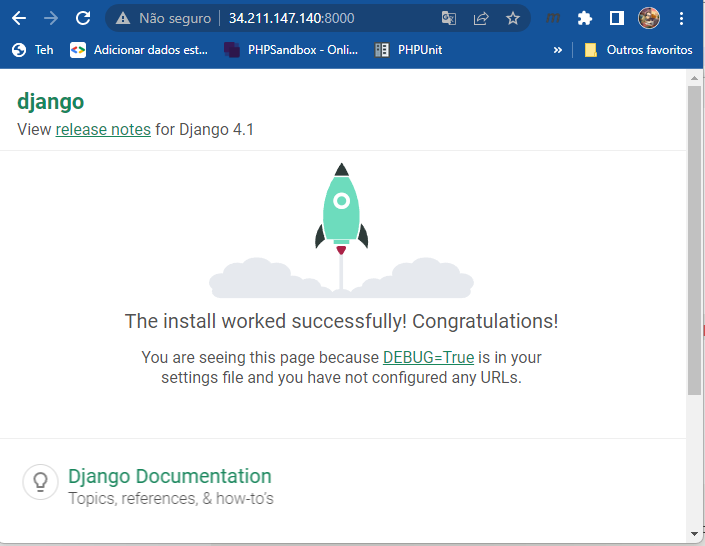

# IaC - Infraestrututa como Código
 
## Sobre
Este repósitorio foi produzido durante meus estudos no curso prático de iniciação ao conceito de Infraestrututa como código da Alura.

Curso: [Infraestrutura como código: preparando máquinas na AWS com Ansible e Terraform](https://cursos.alura.com.br/course/infraestrutura-codigo-maquinas-aws-ansible-terraform/task/96416)

Instrutores: [Leonardo Sartorello](https://www.linkedin.com/in/leonardomsartorello/), [Guilherme Lima](https://www.linkedin.com/in/guilherme-lima-458925178/)

Plataforma: [Alura](https://www.alura.com.br/)

## Aprendizado

No curso, aprendi as vantagens da IaC e pratiquei a montagem de uma infraestrutura na AWS utilizando EC2, Terraform e Ansible.

Pontos altos da prática/aprendizado:
  - criação automatizada de uma instância EC2 através do Terraform com conexão SSH;
  - execução automatizada de comandos linux dentro da instância EC2 durante sua criação com o Terraform;
  - execução automatizada de comandos linux dentro da instância EC2 após sua criação com o Ansible;
  - instalação automatizada de dependências e bibliotecas para um projeto python/Django com o Ansible. Os conceitos podem ser utilizados para instalar dependências de outras tecnologias;
  - Modificação automatizada de arquivos de configuração na EC2 utilizando Ansible;
## Replique o resultado do projeto deste repositório

Ao final você deve ter um projeto Django em nuvem pronto para iniciar o desenvolvimento.

Pré-requisitos:
- familiaridade com o AWS Console na Web, em especial com o serviço EC2
- familiaridade com a linha de comando e com conexões SSH

***Cuidado! Lembre-se de ao final encerrar a sua instância EC2 para evitar cobranças inesperadas. Para isso siga o passo "Encerrando a Instância EC2"***

Nota1: Os comandos de instalação e configuração do ambiente de desenvolvimento a seguir, são, a princípio, para o Ubuntu 22.04

Nota2: É necessário que você crie/possua uma conta na AWS
### Faça um clone deste repositório para o seu ambiente de desenvolvimento
```bash
git clone https://github.com/10diieggos/IaC.git
```
### Instale o Terraform
```bash
curl -fsSL https://apt.releases.hashicorp.com/gpg | sudo apt-key add -
sudo apt-add-repository "deb [arch=$(dpkg --print-architecture)] https://apt.releases.hashicorp.com $(lsb_release -cs) main"
sudo apt install terraform
```
### Instale o Ansible

```bash
sudo apt update
sudo apt install software-properties-common
sudo add-apt-repository --yes --update ppa:ansible/ansible
sudo apt-get install ansible
```
### Instale o AWS CLI
```bash
curl "https://awscli.amazonaws.com/awscli-exe-linux-x86_64.zip" -o "awscliv2.zip"
sudo apt install unzip
unzip awscliv2.zip
sudo ./aws/install
```

### Configure o AWS CLI
Caso ainda não possua, crie uma [chave de acesso]() para a sua conta AWS.

De posse da chave, inicie a configuração com o comando:

```bash
aws configure
```
### Configure o acesso SSH

Caso ainda não possua, [crie um par de chaves]() SSH no console da AWS e baixe a chave privada para a pasta do repositório IaC clonado.

Configure as permissões da chave com o comando abaixo:
```bash
chmod 400 nome_do_arquivo_da_sua_chave_SSH_privada.pem
```

No arquivo main.tf substitua o nome da minha chave privada pelo nome da sua chave privada, sem a extensão .pem

```
resource "aws_instance" "app_server" {
  ...

  key_name = "nome_do_arquivo_da_sua_chave_SSH_privada_sem_a_extensao"

  ...
}
```
### Crie a instância EC2 com Terraform
Na pasta do repositorio clonado rode o comando:

```bash
terraform init
```
Aguarde o fim da execução e rode o próximo comando:
```bash
terraform apply
```

Na saída do comando você verá todas as configurações planificadas para o recurso (instância EC2) e aparecerá ao fim o questinamento:

```bash
Plan: 1 to add, 0 to change, 0 to destroy.
Do you want to perform these actions?
  Terraform will perform the actions described above.
  Only 'yes' will be accepted to approve.

  Enter a value:
```
Digite yes e tecle enter
Sua instância EC2 será criada. Acesse o AWS Console na web para conferir
### Instale as dependências e inicie o servidor python com o Ansible
No AWS Console, copie o endereço ip externo da sua instância EC2.
No arquivo hosts.yml, no repositório clonado, cole o endereço ip externo da sua instância EC2.

```yml
[terraformansible]
cole.aqui.seu.ip.substuindo.o.que.estiver.no.lugar
```
Na pasta do repositorio clonado rode o comando abaixo, substuindo o treco sua_chave_SSH_privada pelo nome do arquivo da sua chave:
```bash
ansible-playbook playbook.yml -u ubuntu --private-key SUA_CHAVE_SSH_PRIVADA.pem -i hosts.yml
```

### Pronto - Verifique o resultado final
Abra um navegador e na barra de endereços digite o ip externo de sua instância EC2 seguido da porta 8000.
```
http://34.211.147.140:8000/ #exemplo
```
Você verá a página abaixo como resultado. Ela significa que um servidor python está rodando e na sua instância EC2 há um projeto iniciado do Django pronto para ser desenvolvido.



### Encerrando a Instância EC2

***este passo é importantíssimo para evitar cobranças inesperadas!***

Na pasta do repositório clonado digite o comando: 
```bash	
terraform destroy
```

Aguarde o questinamento que será apresentado como abaixo, digite yes e tecle enter
```bash
Plan: 0 to add, 0 to change, 1 to destroy.

Do you really want to destroy all resources?
  Terraform will destroy all your managed infrastructure, as shown above.
  There is no undo. Only 'yes' will be accepted to confirm.

  Enter a value:
```

Será bom verificar no seu AWS Console, na web, se a instância foi encerrada. Caso note algo errado encerre manualmente a instância junto com o seu volume.

## Previna-se de publicar a sua chave privada
Neste repositório há um arquivo .gitignore que impede arquivos com a extensão .pem e .ppk de serem indevidamente expostos em repositórios públicos.
Tenha cuidado para não expor a sua chave privada.

